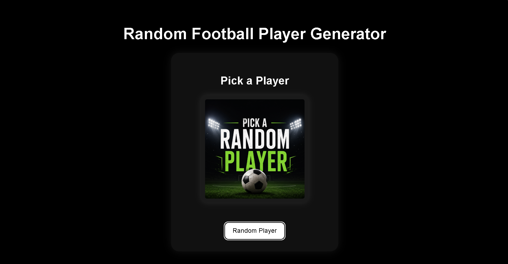
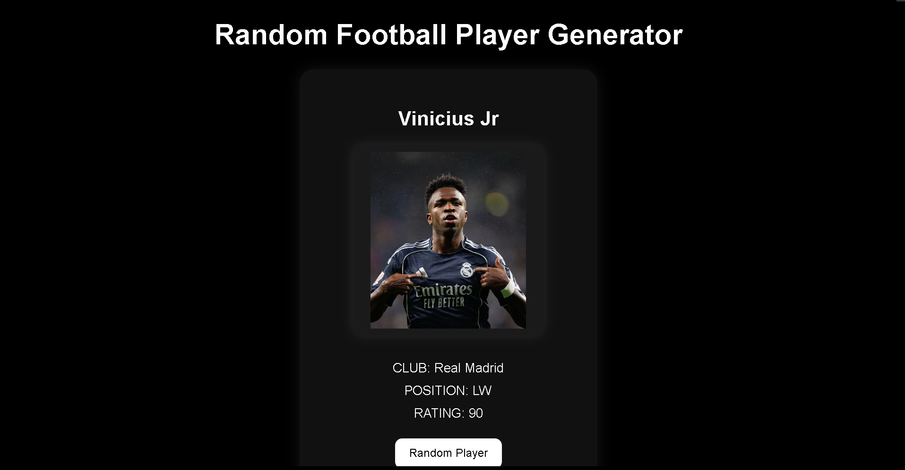
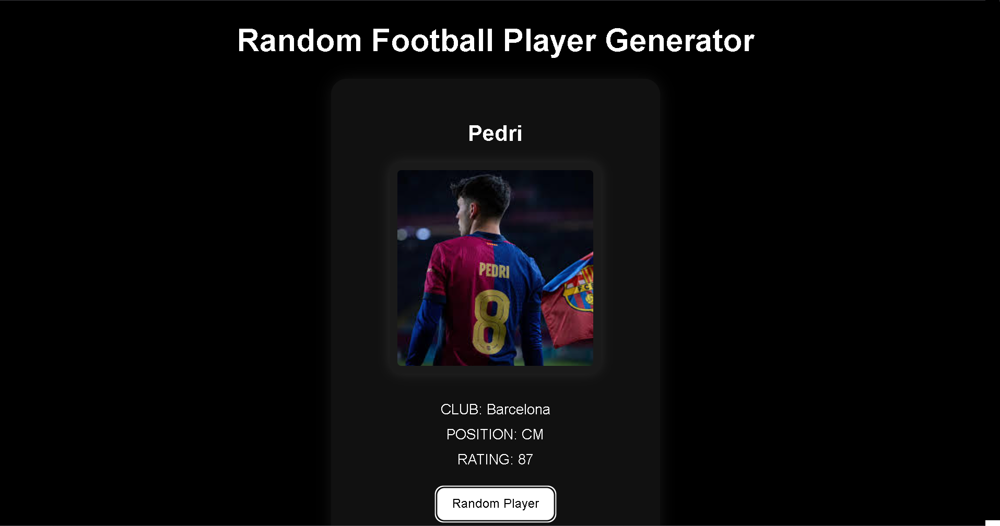

# ⚽ Football Player Generator

A fun football-themed web application built using **HTML, CSS, and JavaScript** that randomly selects football players with images.

## 🚀 Features

* 🎲 Random football player generator
* 🖼️ Player images
* 🚫 No immediate repeats
* ⎋ Escape key reset
* 🔄 Default screen reset
* ⚡ Fast random selection
* 🎨 Clean football-themed UI

## 🛠️ Tech Stack

* HTML
* CSS
* JavaScript

## 📸 Preview





## ⚙️ How to Run

1. Clone the repository

```bash
git clone https://github.com/aaryananu2210/football-player-generator.git
```

2. Open the project folder

3. Run `index.html`

## 📚 What I Learned

This project helped me understand:

* JavaScript fundamentals
* Arrays & Objects
* DOM manipulation
* Event listeners
* Keyboard events
* Random logic
* Conditional logic

---

Built as part of my **Full Stack + AI/ML learning journey 🚀**
